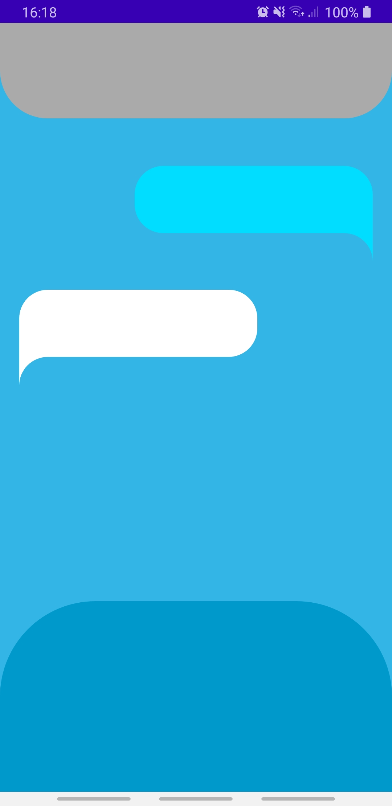
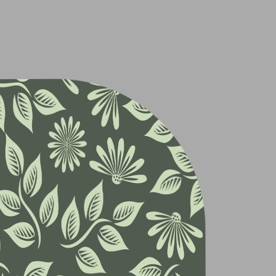
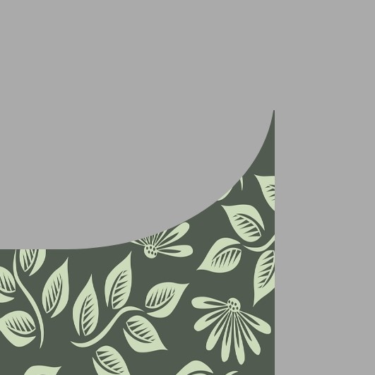
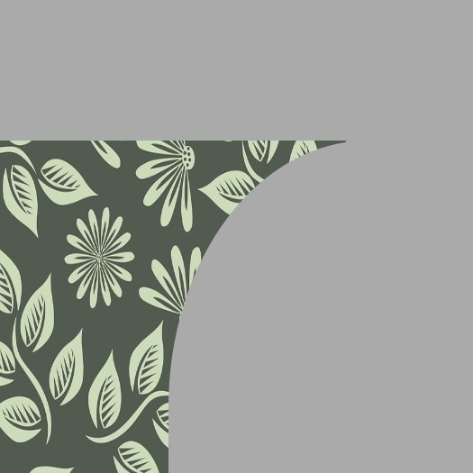
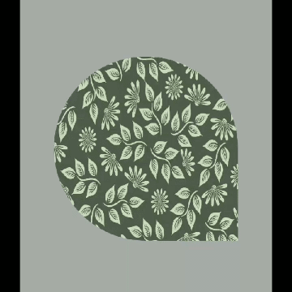
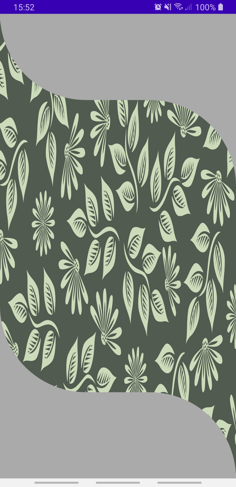
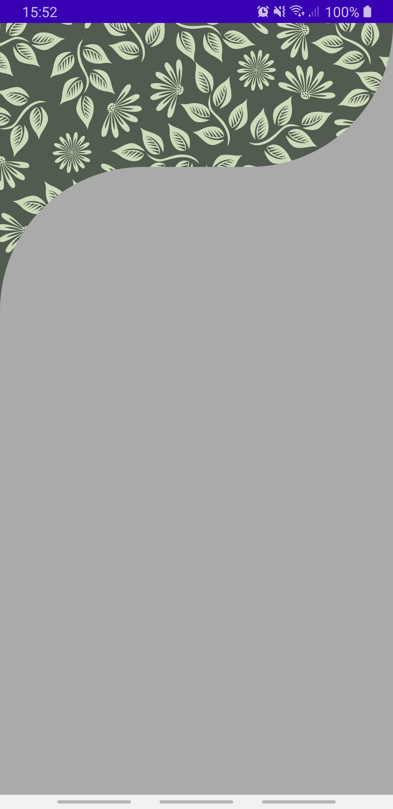
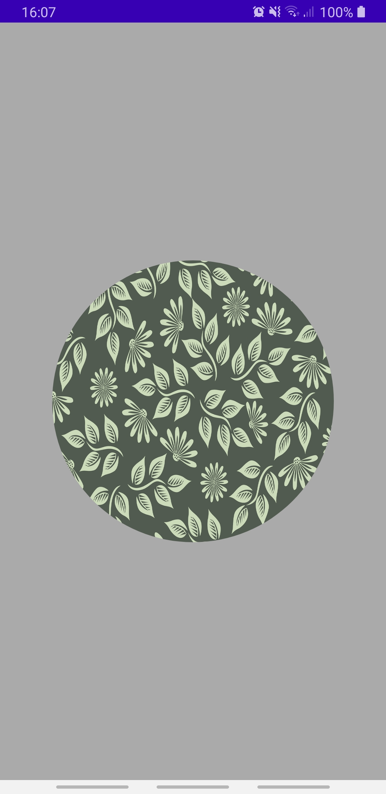
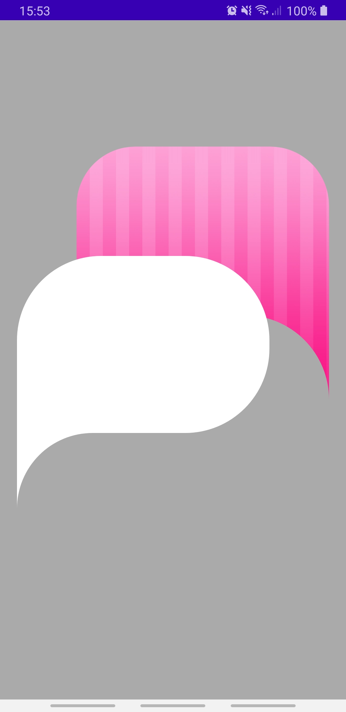

# ArcLibrary

An android library for Layouts with rounded corners

## Install

Add JitPack in your root build.gradle at the end of repositories:

    allprojects {
            repositories {
                ...
                maven { url 'https://jitpack.io' }
            }
        }
        
Add ArcLibrary dependency

    dependencies {
                implementation 'com.github.stelladk:ArcLibrary:0.1.0'
        }

## How to use
In your layout declare a namespace for the library

    xmlns:arclib="http://schemas.android.com/tools"

Now you can use the ArcLayout 

    <com.stelladk.arclib.ArcLayout
        android:id="@+id/arcLayout"
        android:layout_width="match_parent"
        android:layout_height="match_parent"
        arclib:ArcType="none"/>

Every corner can be customised separately.

With the attribute **ArcType** you can specify the corner type you want. The default value is `"none"`.

|`arclib:TopRightArc="inner"`|`arclib:TopRightArc="outer"`|
|---|---|
|||

With the attribute **OuterAxis** you can specify the direction of the outer corners of your layout.

|`arclib:TopRightOuterAxis="y_axis"`|`arclib:TopRightOuterAxis="x_axis"`|
|---|---|
|||

With the attribute **ArcRadius** you can specify the radius of your corners.

`arclib:BottomRightRadius="150dp"`

With the attributes **ArcType**, **OuterAxis** and **ArcRadius** you can specify the default values of all four corners.

---

There are all different kind of shapes that you can build.

### Example 1

    <com.stelladk.arclib.ArcLayout
        android:layout_width="match_parent"
        android:layout_height="match_parent"

        arclib:ArcType="inner"
        arclib:TopLeftArc="outer"
        arclib:BottomRightArc="outer"
        arclib:OuterAxis="y_axis"
        arclib:ArcRadius="150dp"/>

### Example 2

    <com.stelladk.arclib.ArcLayout
        android:layout_width="match_parent"
        android:layout_height="300dp"

        arclib:BottomLeftArc="outer"
        arclib:BottomRightArc="inner"
        arclib:ArcRadius="150dp"/>

### Example 3

    <com.stelladk.arclib.ArcLayout
        android:layout_width="300dp"
        android:layout_height="300dp"

        arclib:ArcType="inner"
        arclib:ArcRadius="150dp"/>

### Example 4

    <com.stelladk.arclib.ArcLayout
        android:id="@+id/bubble_pink"
        android:layout_width="300dp"
        android:layout_height="300dp"

        arclib:ArcType="inner"
        arclib:OuterAxis="y_axis"
        arclib:ArcRadius="70dp"
        arclib:BottomRightArc="outer"
        arclib:BottomRightRadius="100dp"
        android:background="@drawable/pink"/>

    <com.stelladk.arclib.ArcLayout
        android:id="@+id/bubble_white"
        android:layout_width="300dp"
        android:layout_height="300dp"

        arclib:ArcType="inner"
        arclib:ArcRadius="100dp"
        arclib:BottomLeftArc="outer"
        arclib:BottomLeftRadius="90dp"/>

---

### Photos used
[pattern.png](app/src/main/res/drawable/pattern.png) from <a href="https://pixabay.com/el/users/lucasgrey-679745/?utm_source=link-attribution&amp;utm_medium=referral&amp;utm_campaign=image&amp;utm_content=4032775" target="_blank">Łukasz Siwy</a> via <a href="https://pixabay.com/el/?utm_source=link-attribution&amp;utm_medium=referral&amp;utm_campaign=image&amp;utm_content=4032775" target="_blank">Pixabay</a>
